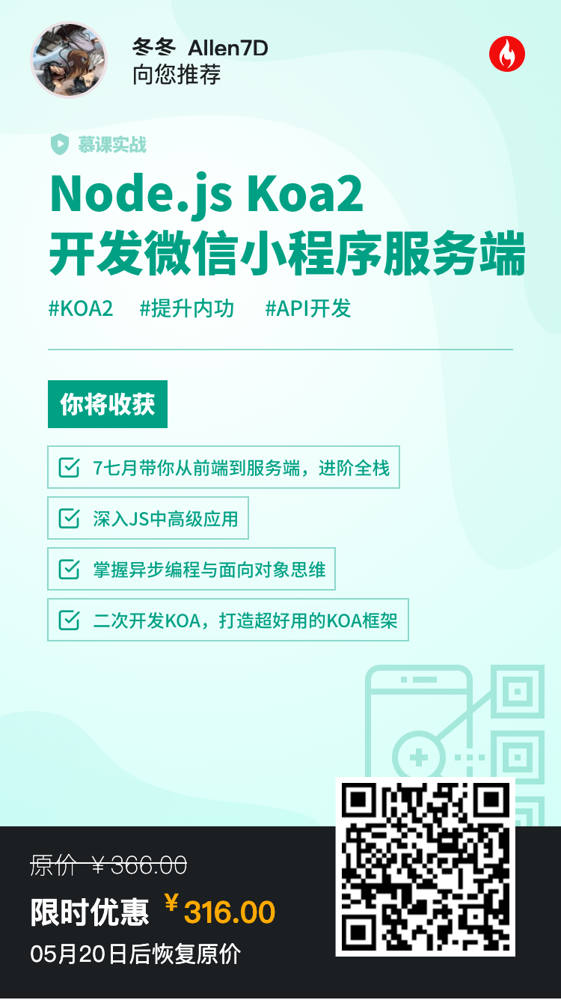

<h1 align="center">
   island-server
</h1>
<h4 align="center">
	Node.js 开发微信小程序·服务端
	 🤜基于 Koa2 框架🤛
</h4>

* 学习慕课网[《纯正商业级应用－Node.js Koa2开发微信小程序服务端》](https://s.imooc.com/SlIXze6)
* QQ 交流群 163801325（聊天、斗图、学习、交流，伸手党勿进），欢迎入群一同讨论
* 感谢慕课网的[七月老师](https://www.imooc.com/t/4294850)

  
  
👆QQ 扫码 👆

### 买课优惠码(8.8折)
> PC端请复制对应的链接; 移动端可以扫描二维码

1. 《纯正商业级应用－Node.js Koa2开发微信小程序服务端》- [优惠链接](https://s.imooc.com/SlIXze6)

    

